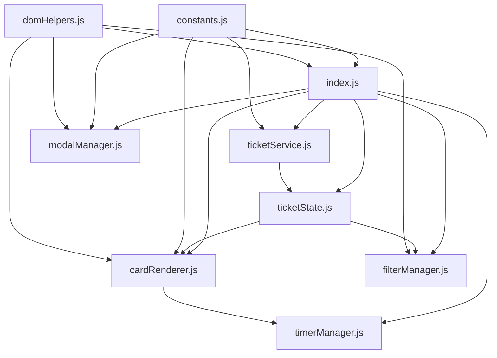

# Plan de Refactorización: seguimientoSolicitud.js

## Objetivo
Refactorizar el archivo monolítico `seguimientoSolicitud.js` (1199 líneas) en una arquitectura modular manteniendo la funcionalidad exacta.

## Análisis Completado

### Archivo Original
- **Ubicación**: `resources/js/seguimientoSolicitud.js`
- **Líneas**: 1199
- **Cargado en**: `resources/views/followOT/index.blade.php` (línea 91)
- **Configuración Vite**: `vite.config.js` (línea 28)

### Problemas Identificados
1. ✅ Función `inicializar()` duplicada (líneas 14-24 y 26-41)
2. ✅ Función `handleModuloChange()` duplicada (líneas 489-503 y 540-554)
3. ✅ Código comentado extenso (líneas 230-255)
4. ✅ Gestión de memoria con temporizadores mejorable
5. ✅ Archivo monolítico difícil de mantener

## Estructura Modular Propuesta

```
resources/js/seguimiento/
├── index.js                          # Punto de entrada principal (~100 líneas)
├── config/
│   └── constants.js                  # Constantes y configuración (~50 líneas)
├── api/
│   └── ticketService.js              # Servicio API (~200 líneas)
├── state/
│   └── ticketState.js                # Gestión de estado (~100 líneas)
├── utils/
│   ├── domHelpers.js                 # Utilidades DOM (~50 líneas)
│   └── timerManager.js               # Gestión de temporizadores (~150 líneas)
└── ui/
    ├── modalManager.js               # Gestión de modales (~300 líneas)
    ├── cardRenderer.js               # Renderizado de tarjetas (~200 líneas)
    └── filterManager.js              # Gestión de filtros (~100 líneas)
```

## Detalle de Módulos

### 1. config/constants.js
**Responsabilidad**: Centralizar todas las constantes y configuraciones
**Contenido**:
- IDs de elementos DOM
- Clases CSS
- Configuraciones de Select2
- Configuraciones de SweetAlert2
- URLs de API endpoints
- Tiempos y duraciones

### 2. api/ticketService.js
**Responsabilidad**: Todas las llamadas al backend
**Métodos**:
- `obtenerModulos()` - GET /FollowOTV2/obtenerAreaModulos
- `obtenerResumen(modulo)` - GET /FollowOTV2/obtenerResumen/{modulo}
- `obtenerRegistros(modulo)` - GET /FollowOTV2/obtenerRegistros/{modulo}
- `obtenerEstados()` - GET /FollowOTV2/obtenerCatalogoEstados
- `obtenerClasesMaquina(maquina)` - GET /FollowOTV2/obtenerClasesMaquina/{maquina}
- `obtenerFallas()` - GET /FollowOTV2/obtenerFallas
- `obtenerCausas()` - GET /FollowOTV2/obtenerCausas
- `obtenerAcciones()` - GET /FollowOTV2/obtenerAcciones
- `iniciarAtencion(ticketId, datos)` - POST /FollowOTV2/iniciarAtencion
- `finalizarAtencion(ticketId, datos)` - POST /FollowOTV2/finalizarAtencion
- `activarBahia(ticketId, motivo)` - POST /FollowOTV2/activarBahia
- `finalizarBahia(ticketId)` - POST /FollowOTV2/finalizarBahia

### 3. state/ticketState.js
**Responsabilidad**: Gestión centralizada del estado
**Propiedades**:
- `tickets` - Array de todos los tickets del módulo
- `ticketsFiltrados` - Array de tickets después de aplicar filtros
- `moduloActual` - Módulo seleccionado actualmente
- `filtros` - Objeto con filtros activos (búsqueda, estado)
- `resumen` - Objeto con contadores de estados

**Métodos**:
- `setTickets(tickets)`
- `getTickets()`
- `setModulo(modulo)`
- `getModulo()`
- `aplicarFiltros()`
- `actualizarResumen(resumen)`

### 4. utils/domHelpers.js
**Responsabilidad**: Utilidades para manipulación del DOM
**Funciones**:
- `getElement(id)` - Obtener elemento por ID con validación
- `getElements(selector)` - Obtener múltiples elementos
- `showElement(element)` - Mostrar elemento
- `hideElement(element)` - Ocultar elemento
- `setTextContent(element, text)` - Establecer texto
- `getCsrfToken()` - Obtener token CSRF
- `isDarkMode()` - Detectar modo oscuro

### 5. utils/timerManager.js
**Responsabilidad**: Gestión de temporizadores de cuenta regresiva
**Clase**: `TimerManager`
**Métodos**:
- `iniciarTemporizadores()` - Iniciar todos los temporizadores visibles
- `detenerTemporizadores()` - Detener y limpiar todos los temporizadores
- `actualizarTemporizador(element, startTime, duration)` - Actualizar un temporizador específico
- `calcularTiempoRestante(startTime, duration)` - Calcular tiempo restante
- `formatearTiempo(segundos)` - Formatear a MM:SS
- `aplicarEstiloSegunTiempo(element, segundos)` - Aplicar colores según tiempo

### 6. ui/modalManager.js
**Responsabilidad**: Gestión de todos los modales SweetAlert2
**Clase**: `ModalManager`
**Métodos**:
- `mostrarModalIniciarAtencion(ticketId, maquina, boton)` - Modal para iniciar atención
- `mostrarModalFinalizarAtencion(ticketId, horaFinalizacion, boton)` - Modal para finalizar
- `mostrarModalEncuesta()` - Modal de encuesta de satisfacción
- `mostrarCargando(mensaje)` - Modal de carga
- `mostrarExito(mensaje)` - Modal de éxito
- `mostrarError(mensaje)` - Modal de error
- `obtenerConfiguracionDarkMode()` - Configuración para modo oscuro

### 7. ui/cardRenderer.js
**Responsabilidad**: Renderizado de tarjetas de tickets
**Clase**: `CardRenderer`
**Métodos**:
- `renderizarTarjetas(tickets)` - Renderizar todas las tarjetas
- `crearTarjetaHTML(ticket)` - Crear HTML de una tarjeta
- `generarBotonesAccion(ticket)` - Generar botones según estado
- `obtenerColorEstado(estado)` - Obtener clases CSS por estado
- `obtenerImagenMecanico(estado, numeroMecanico)` - Obtener URL de imagen

### 8. ui/filterManager.js
**Responsabilidad**: Gestión de filtros y búsqueda
**Clase**: `FilterManager`
**Métodos**:
- `aplicarFiltros()` - Aplicar filtros activos
- `filtrarPorTexto(tickets, texto)` - Filtrar por búsqueda
- `filtrarPorEstado(tickets, estado)` - Filtrar por estado
- `resetearFiltros()` - Limpiar todos los filtros
- `mostrarBarraFiltros()` - Mostrar barra de filtros
- `ocultarBarraFiltros()` - Ocultar barra de filtros

### 9. index.js (Principal)
**Responsabilidad**: Orquestación e inicialización
**Funciones**:
- `inicializar()` - Función principal de inicialización
- `configurarEventListeners()` - Configurar todos los event listeners
- `seleccionarModuloDesdeURL()` - Cargar módulo desde parámetro URL
- `handleModuloChange()` - Manejar cambio de módulo
- `handleIniciarAtencion()` - Manejar inicio de atención
- `handleFinalizarAtencion()` - Manejar finalización
- `handleActivarBahia()` - Manejar activación de bahía
- `handleReanudarBahia()` - Manejar reanudación

## Flujo de Datos



## Mejoras Implementadas

### 1. Eliminación de Duplicados
- ✅ Eliminar primera función `inicializar()` (líneas 14-24)
- ✅ Eliminar segunda función `handleModuloChange()` (líneas 540-554)
- ✅ Eliminar código comentado (líneas 230-255)

### 2. Gestión de Memoria
- ✅ Mejorar limpieza de temporizadores
- ✅ Prevenir fugas de memoria en event listeners
- ✅ Limpiar referencias al cambiar de módulo

### 3. Manejo de Errores
- ✅ Try-catch en todas las funciones async
- ✅ Mensajes de error descriptivos
- ✅ Logging consistente para debugging

### 4. Documentación
- ✅ JSDoc en todas las funciones
- ✅ Comentarios explicativos
- ✅ Tipos de parámetros documentados

## Pasos de Implementación

### Fase 1: Crear Estructura Base
1. ✅ Crear carpeta `resources/js/seguimiento/`
2. ✅ Crear subcarpetas: `config/`, `api/`, `state/`, `utils/`, `ui/`
3. ✅ Crear archivos vacíos con estructura básica

### Fase 2: Implementar Módulos Base
4. ✅ Implementar `config/constants.js`
5. ✅ Implementar `utils/domHelpers.js`
6. ✅ Implementar `state/ticketState.js`

### Fase 3: Implementar Servicios
7. ✅ Implementar `api/ticketService.js`
8. ✅ Implementar `utils/timerManager.js`

### Fase 4: Implementar UI
9. ✅ Implementar `ui/modalManager.js`
10. ✅ Implementar `ui/cardRenderer.js`
11. ✅ Implementar `ui/filterManager.js`

### Fase 5: Integración
12. ✅ Implementar `index.js` principal
13. ✅ Actualizar `vite.config.js`
14. ✅ Actualizar `index.blade.php`

### Fase 6: Testing y Validación
15. ✅ Probar carga de módulos
16. ✅ Probar inicio de atención
17. ✅ Probar finalización de atención
18. ✅ Probar activación/reanudación de bahía
19. ✅ Probar filtros y búsqueda
20. ✅ Probar temporizadores
21. ✅ Validar modo oscuro
22. ✅ Validar en diferentes navegadores

## Cambios en Archivos Existentes

### vite.config.js
```javascript
// ANTES (línea 28):
'resources/js/seguimientoSolicitud.js',

// DESPUÉS:
'resources/js/seguimiento/index.js',
```

### resources/views/followOT/index.blade.php
```blade
<!-- ANTES (línea 91): -->
@vite(['resources/js/seguimientoSolicitud.js', 'resources/js/AsisVirFlo.js'])

<!-- DESPUÉS: -->
@vite(['resources/js/seguimiento/index.js', 'resources/js/AsisVirFlo.js'])
```

## Archivo de Respaldo

El archivo original `seguimientoSolicitud.js` se mantendrá intacto como referencia:
- **Ubicación**: `resources/js/seguimientoSolicitud.js`
- **Propósito**: Consulta y comparación durante la migración
- **Acción futura**: Puede eliminarse después de validar completamente la refactorización

## Beneficios Esperados

### Mantenibilidad
- ✅ Archivos pequeños y enfocados (50-300 líneas)
- ✅ Responsabilidades claras
- ✅ Fácil localización de código

### Testabilidad
- ✅ Funciones puras testables
- ✅ Dependencias inyectables
- ✅ Mocks más sencillos

### Escalabilidad
- ✅ Fácil agregar nuevas funcionalidades
- ✅ Módulos reutilizables
- ✅ Arquitectura extensible

### Colaboración
- ✅ Múltiples desarrolladores sin conflictos
- ✅ Code reviews más efectivos
- ✅ Onboarding más rápido

## Compatibilidad

### Navegadores Soportados
- ✅ Chrome/Edge (últimas 2 versiones)
- ✅ Firefox (últimas 2 versiones)
- ✅ Safari (últimas 2 versiones)

### Dependencias
- ✅ jQuery (para Select2)
- ✅ Select2
- ✅ SweetAlert2
- ✅ Vite/Laravel

### APIs del Backend
- ✅ Todas las rutas existentes se mantienen sin cambios
- ✅ Formato de respuestas JSON sin modificar
- ✅ Autenticación CSRF sin cambios

## Notas Importantes

1. **No Breaking Changes**: La refactorización NO modifica ninguna funcionalidad existente
2. **Experiencia de Usuario**: Idéntica a la versión original
3. **Performance**: Mejora esperada por mejor gestión de memoria
4. **Modo Oscuro**: Totalmente compatible
5. **Responsive**: Mantiene diseño responsive actual

## Próximos Pasos

Una vez completada la refactorización, solicitar cambio al modo **Code** para implementar todos los archivos según este plan.