# Guia de usuario final

Centro de Atencion de Mantenimiento - FormGuest V3 y Seguimiento de solicitudes

Esta guia explica como levantar, dar seguimiento y cerrar una solicitud de mantenimiento desde la pantalla publica del sistema. Esta pensada para supervisores, operarios, mecanicos o personal de piso que necesita usar el sistema sin conocer detalles tecnicos.

Ejemplo usado en esta guia:

- Modulo: `107A`
- Operario: `MARGARITA ALVAREZ AYALA - 0024116`
- Maquina: `BOTON`
- Problema: `DESENSARTA LOS HILOS`
- Folio generado: `OT-99F930`
- Mecanico asignado: `MAURILIO DOMINGUEZ SANCHEZ`
- Estado final del ejemplo: `ATENDIDO`

## 1. Ingreso al Centro de Atencion

Al abrir la pantalla, el sistema muestra un chat guiado. No es necesario escribir texto libre: el sistema va mostrando botones y listas para seleccionar la informacion correcta.

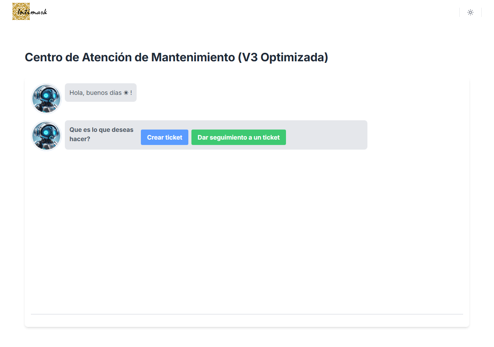

Opciones iniciales:

- **Crear ticket**: se usa cuando hay una falla, problema o necesidad de mantenimiento.
- **Dar seguimiento a un ticket**: se usa para revisar solicitudes ya generadas en los ultimos dias.

## 2. Crear un ticket

Presiona **Crear ticket**. El sistema pedira primero el area o modulo donde ocurre el problema.

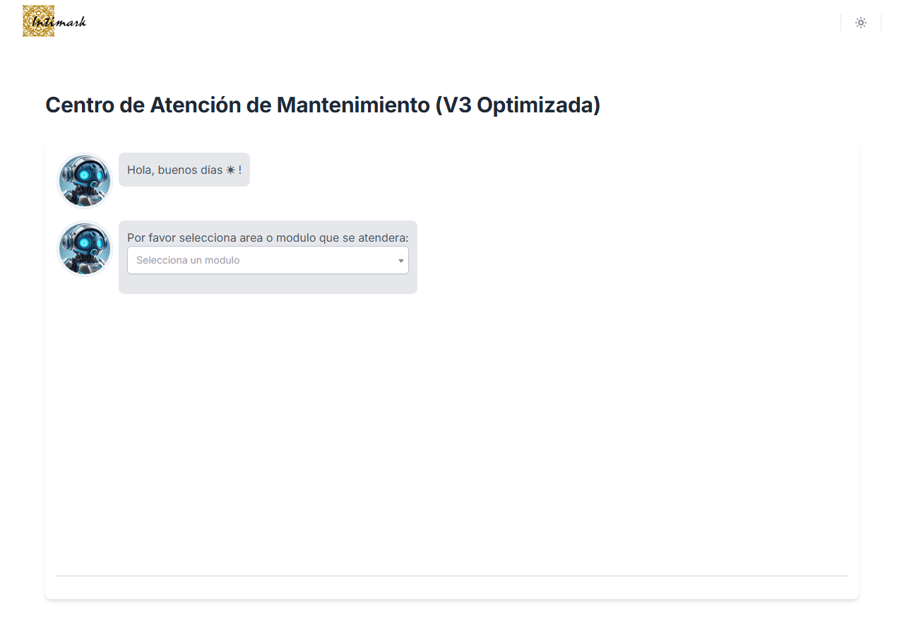

### Que decide el sistema al seleccionar el modulo

El sistema consulta el catalogo de areas y modulos. Dependiendo del tipo de modulo:

- Si el modulo es de tipo **supervisor**, pedira operario, maquina y problema.
- Si el modulo es de tipo **catalogo** o area general, se genera una orden directa para mecatronico con maquina `N/A`.

En el ejemplo se selecciona `107A`.

## 3. Seleccionar operario

Despues de elegir el modulo, el sistema muestra la lista de operarios. Normalmente aparecen primero los operarios relacionados con el modulo seleccionado.

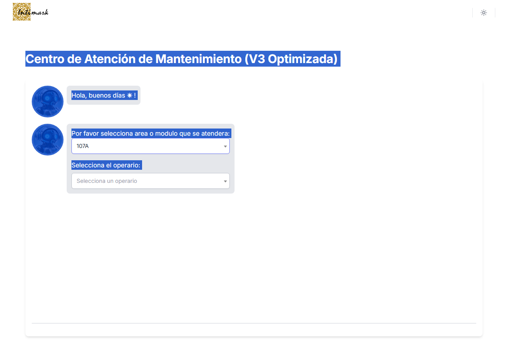

En el ejemplo se selecciona:

`MARGARITA ALVAREZ AYALA - 0024116`

## 4. Seleccionar maquina

Una vez elegido el operario, el sistema pide el tipo de maquina.

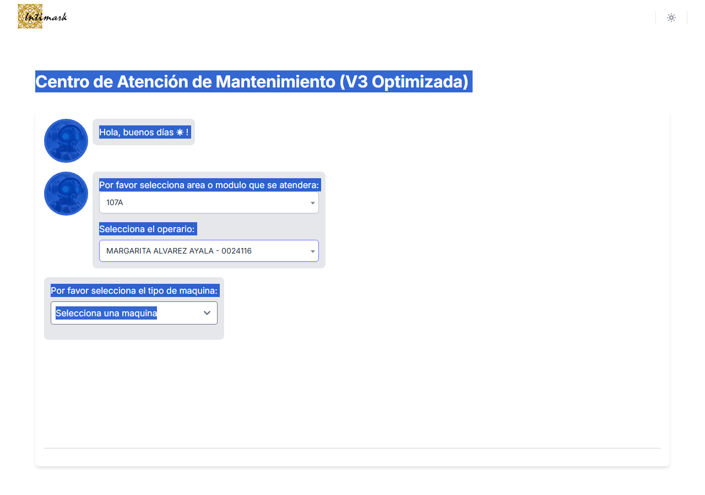

Tipos de maquina disponibles:

`RECTA 1 AGUJA`, `RECTA 2 AGUJAS`, `OVERLOCK`, `COVERSTITCH`, `PRESILLADORA`, `ZZ`, `OJAL`, `BOTON`, `SCHIPS`, `ISEW`, `FLAT SEAMER`, `SUPREME`.

En el ejemplo se selecciona `BOTON`.

## 5. Seleccionar problema

Despues de elegir la maquina, selecciona el problema desde el catalogo. Puedes buscar por nombre.

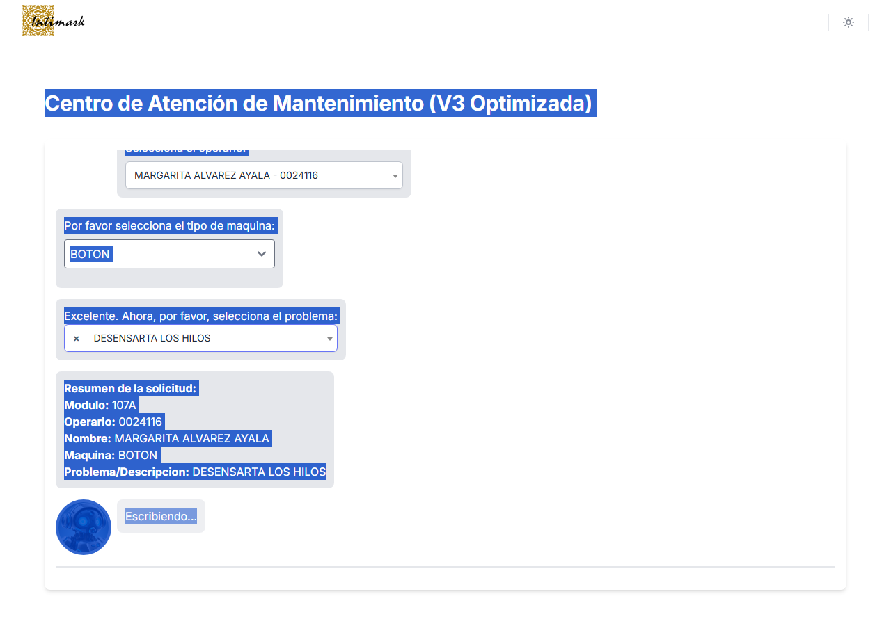

El sistema muestra un resumen con:

- Modulo
- Operario
- Numero de operario
- Maquina
- Problema o descripcion

Revisa que los datos sean correctos antes de continuar.

### Que pasa si cambias una seleccion

Si ya avanzaste y cambias el modulo, la maquina o el problema, el sistema puede advertirte que se reiniciaran los pasos posteriores. Esto evita que quede mezclada informacion vieja con informacion nueva.

## 6. Pasos de ayuda

Algunos problemas tienen pasos de ayuda. En esos casos, el sistema intenta resolver la falla antes de enviar la orden a mantenimiento.

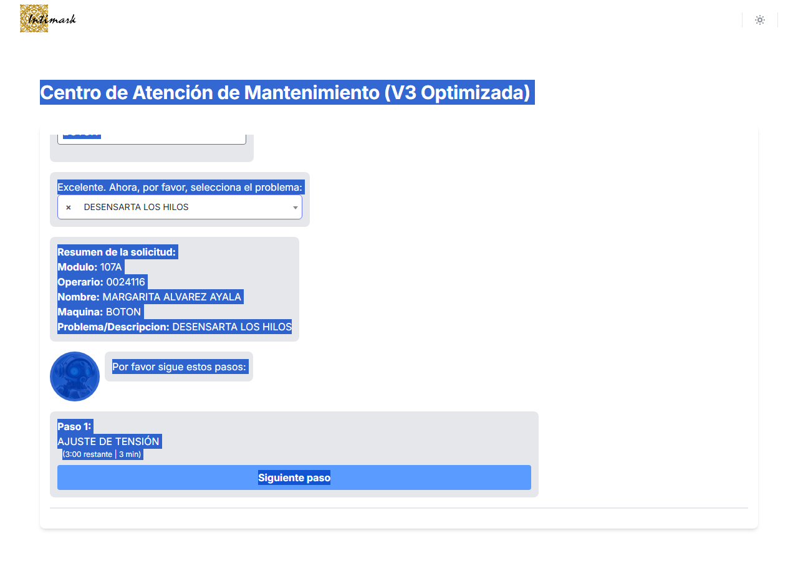

Cada paso tiene un tiempo estimado. Puedes esperar a que termine o presionar **Siguiente paso** si ya realizaste la revision.

Ejemplos de pasos que el sistema puede mostrar:

- Ajuste de tension
- Tipo y posicion de agujas
- Enhebrado de hilo
- Presion de prensatelas
- PPP

### Que decide el sistema con los pasos

Si el problema tiene pasos configurados, el sistema registra el tiempo estimado y el tiempo real usado durante la guia. Esa informacion ayuda a medir cuanto se intento resolver antes de pedir apoyo tecnico.

Si el problema no tiene pasos de ayuda, el sistema genera la orden directamente.

## 7. Decision final despues de la ayuda

Al terminar los pasos, el sistema pregunta si el problema se resolvio.

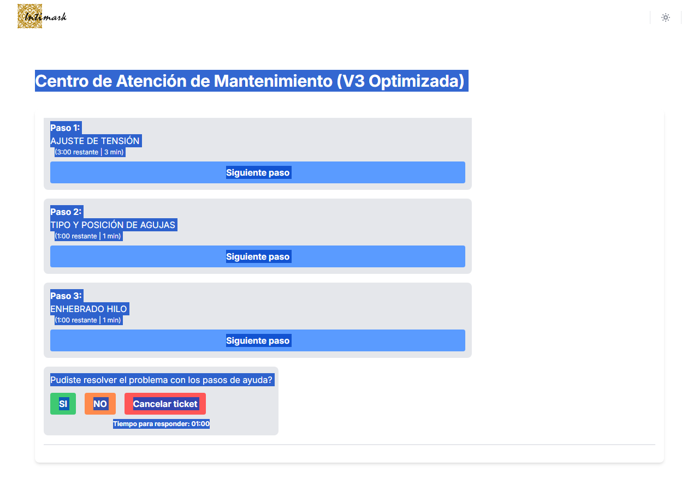

Opciones:

- **SI**: el problema se resolvio con la guia. El ticket queda como `AUTONOMO`.
- **NO**: el problema no se resolvio. Se genera una orden de trabajo y se asigna mecanico si hay disponibilidad.
- **Cancelar ticket**: cancela la solicitud. Si no respondes en 1 minuto, el sistema tambien puede cancelarla por inactividad.

## 8. Ticket registrado

Si eliges **NO**, el sistema crea el ticket y muestra el folio.

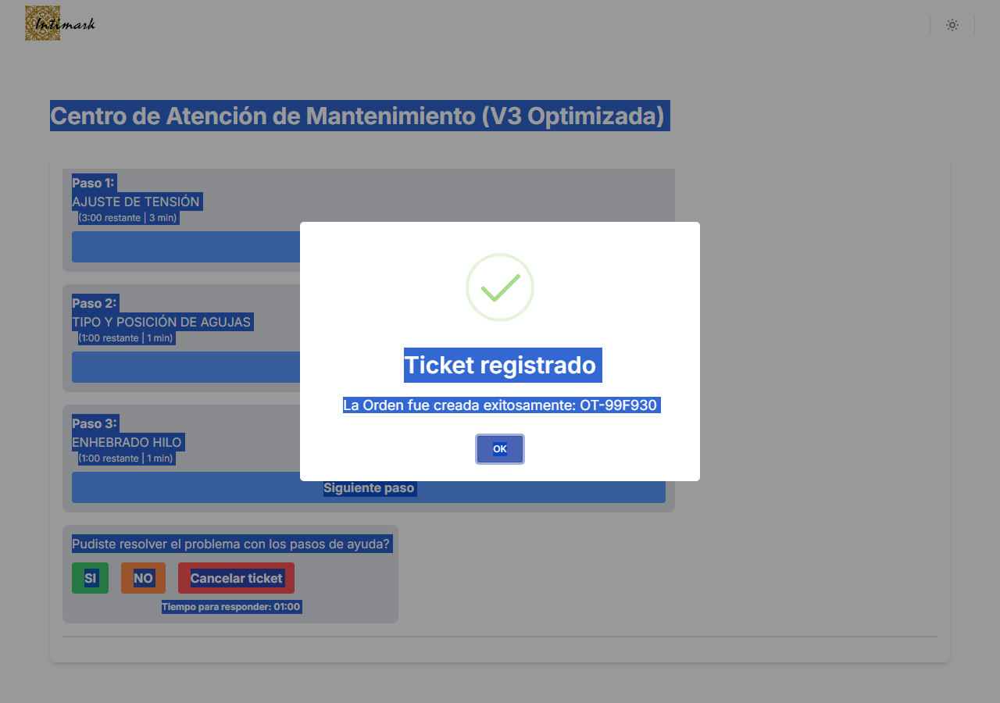

En el ejemplo se genero el folio:

`OT-99F930`

### Como se asigna el mecanico

El sistema busca mecanicos vinculados al modulo. Para asignar considera:

- Que el mecanico pertenezca al modulo.
- Que no este en horario de comida o break.
- Si hay varios disponibles, elige al que tiene menor carga de tickets del dia.
- Si no hay mecanico disponible, la solicitud queda sin asignacion o pendiente para gestion posterior.

### Horario normal y tiempo extra

El sistema tambien marca si el ticket cae en tiempo normal o tiempo extra:

- Lunes a jueves, de 08:00 a 19:00: tiempo normal.
- Viernes, de 08:00 a 14:00: tiempo normal.
- Fuera de esos horarios, sabado o domingo: tiempo extra.

## 9. Seguimiento de solicitudes

Despues de crear el ticket, el sistema redirige a la pantalla de seguimiento del modulo.

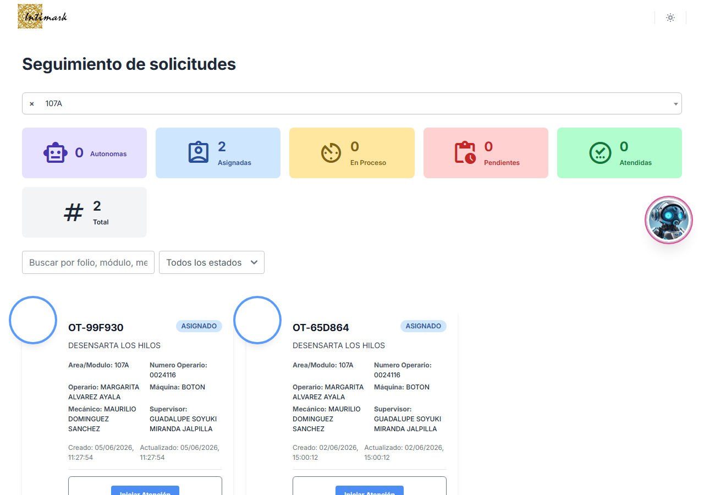

La pantalla muestra:

- Contadores por estado.
- Busqueda por folio, modulo o mecanico.
- Filtro por estado.
- Tarjetas con los datos principales de cada solicitud.

Importante: esta pantalla carga solicitudes creadas en los ultimos 4 dias. Si un ticket es mas antiguo, puede no aparecer aqui aunque exista en reportes o historial.

## 10. Estados principales

Estados que puede ver el usuario:

- `AUTONOMO`: el problema fue resuelto por el usuario con la guia.
- `ASIGNADO`: el ticket ya tiene mecanico asignado y esta listo para iniciar atencion.
- `EN PROCESO`: el mecanico ya inicio la atencion.
- `PENDIENTE` o `SIN ASIGNACION`: no hay mecanico asignado o requiere gestion.
- `ATENDIDO`: la atencion fue finalizada y documentada.
- `CANCELADO`: el ticket fue cancelado por el usuario o por inactividad.

## 11. Iniciar atencion

Cuando el ticket esta `ASIGNADO`, aparece el boton **Iniciar Atencion**.

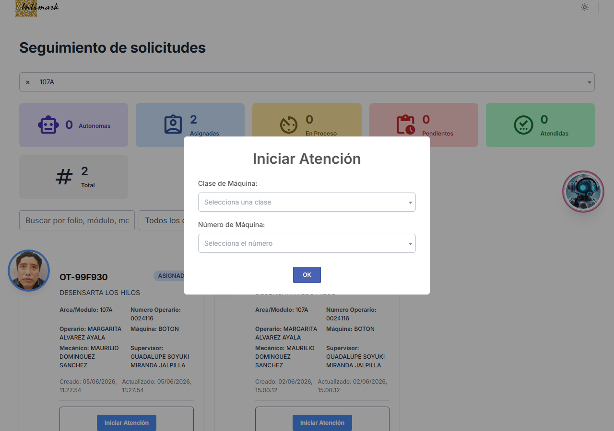

El sistema pide:

- **Clase de maquina**: por ejemplo `AH`.
- **Numero de maquina**: por ejemplo `I00696`.

Al confirmar, el ticket cambia a `EN PROCESO`.

### Temporizador de atencion

Cuando el ticket esta en proceso, se muestra un tiempo restante. El sistema puede avisar:

- Cuando faltan 5 minutos.
- Cuando falta 1 minuto.
- Cuando el tiempo se excede.

## 12. Tiempo Bahia

Si la atencion debe pausarse por una razon operativa, usa **Activar Tiempo Bahia**.

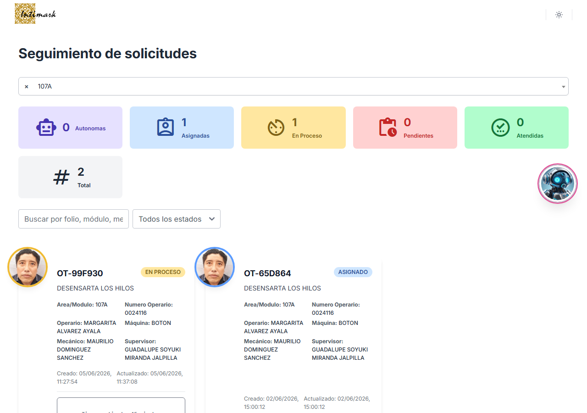

Mientras el ticket esta pausado, aparece **Reanudar Atencion**.

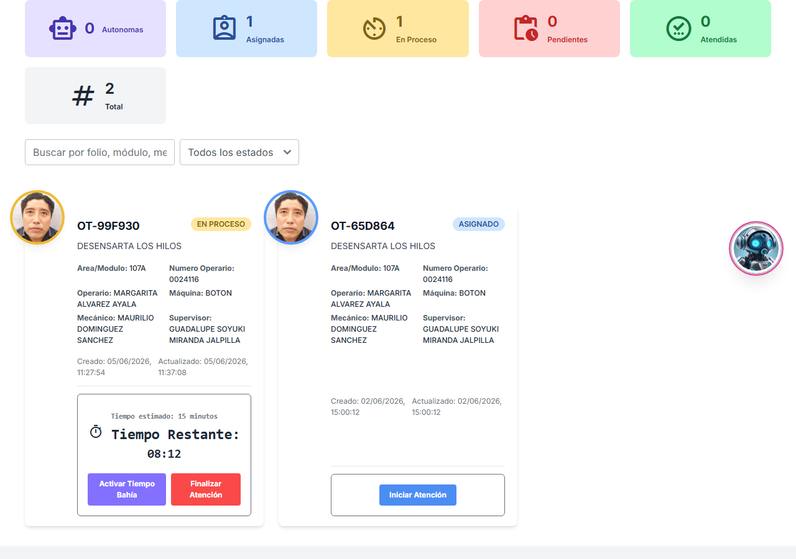

El tiempo de bahia se descuenta del tiempo real de atencion para que el calculo sea mas justo.

## 13. Finalizar atencion

Cuando el mecanico termina, presiona **Finalizar Atencion**.

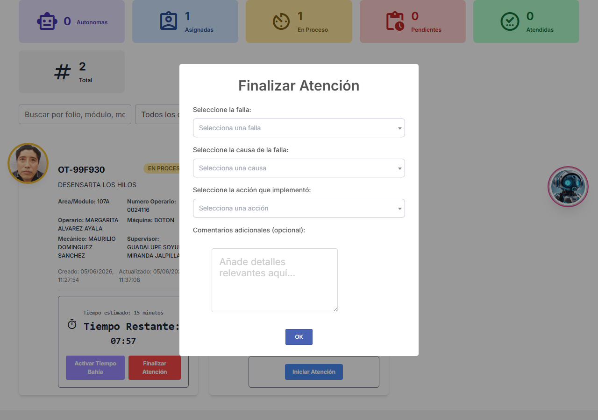

El sistema solicita:

- **Falla**: problema atendido.
- **Causa de la falla**: motivo detectado.
- **Accion implementada**: solucion aplicada.
- **Comentarios adicionales**: notas utiles para historial.

Ejemplo documentado:

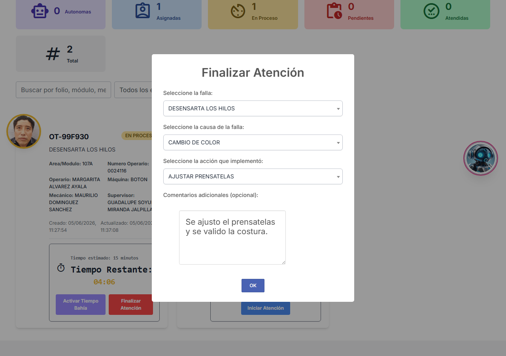

Datos usados en el ejemplo:

- Falla: `DESENSARTA LOS HILOS`
- Causa: `CAMBIO DE COLOR`
- Accion: `AJUSTAR PRENSATELAS`
- Comentario: `Se ajusto el prensatelas y se valido la costura.`
- Encuesta: `Excelente`

Al finalizar correctamente, el ticket cambia a `ATENDIDO`.

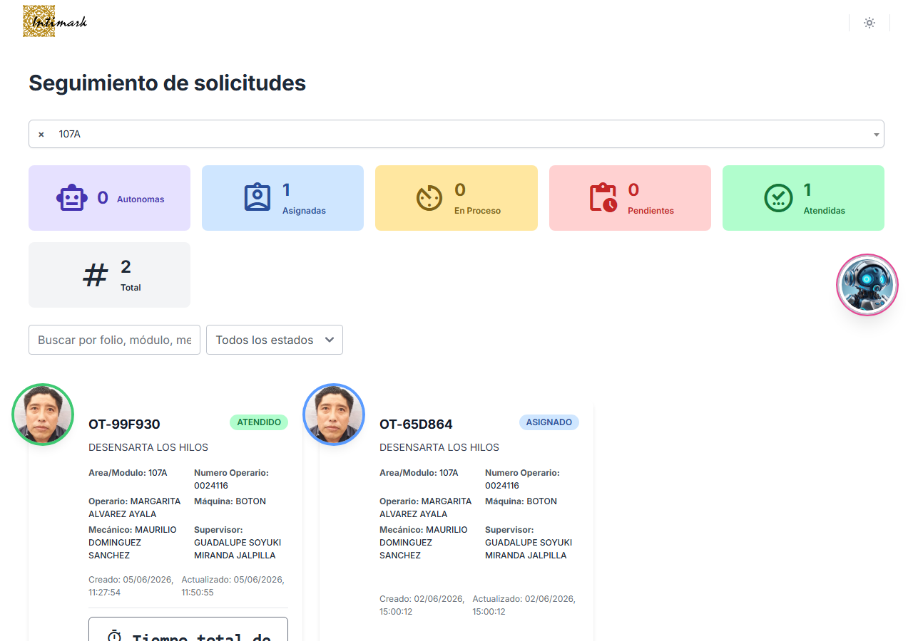

## 14. Buenas practicas para usuarios

- Verifica modulo, operario y maquina antes de avanzar.
- Si el sistema muestra pasos de ayuda, practicalos antes de solicitar mantenimiento.
- Usa **NO** solo cuando el problema realmente requiere apoyo tecnico.
- Conserva el folio para seguimiento.
- En seguimiento, usa el buscador si hay muchas tarjetas.
- Al cerrar la atencion, documenta causa y accion con la mayor precision posible.

## 15. Problemas comunes

**No encuentro mi modulo.**  
Puede que el modulo no este en el catalogo local o que necesite sincronizacion.

**No veo un ticket antiguo.**  
La pantalla de seguimiento muestra tickets de los ultimos 4 dias.

**El ticket no tiene mecanico.**  
Puede no haber mecanico disponible por comida, break, carga de trabajo o falta de vinculacion al modulo.

**El sistema cancelo el ticket.**  
Si en la pregunta final no se responde dentro del tiempo, el sistema puede cancelar por inactividad.

**La notificacion no aparece en tiempo real.**  
El ticket se puede crear aunque falle la notificacion externa. En ese caso se debe revisar desde seguimiento.

## 16. Resultado del ejemplo

El flujo de prueba genero y cerro el ticket `OT-99F930`:

- Creado: `05/06/2026 11:27:54`
- Iniciado: `05/06/2026 11:37:08`
- Finalizado: `05/06/2026 11:50:55`
- Estado final: `ATENDIDO`
- Tiempo de ejecucion registrado: `827` segundos
- Pausa de bahia registrada: `169` segundos

