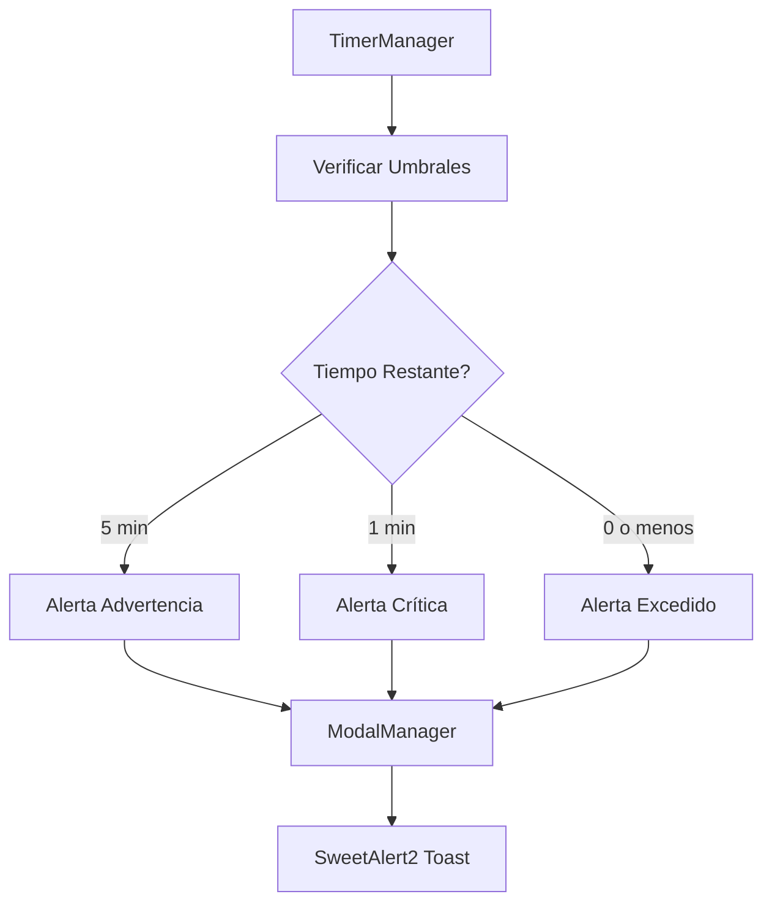

# Sistema de Alertas Temporales Inteligente

## 🎯 Objetivo

Implementar un sistema proactivo de notificaciones que alerte al usuario sobre el estado del tiempo de atención en momentos críticos, mejorando la gestión del tiempo y evitando que se excedan los límites establecidos.

## 🔔 Tipos de Alertas

**Nota importante:** Las alertas solo se muestran para tickets en estado "EN PROCESO" (atenciones activas). Los tickets finalizados o en otros estados no generan notificaciones.

### 1. Alerta de Advertencia (⚠️ Amarilla)
**Umbral:** 5 minutos restantes

**Características:**
- Color: Amarillo
- Icono: ⚠️ Warning
- Duración: 4 segundos
- Posición: Top-right (toast)
- Se activa: Una sola vez por ticket activo

**Información mostrada:**
- Número de ticket (folio)
- Descripción del problema
- Tiempo restante en minutos
- Mensaje: "El tiempo de atención está por agotarse"

**Propósito:** Dar aviso temprano para que el usuario pueda planificar la finalización.

### 2. Alerta Crítica (🔥 Naranja)
**Umbral:** 1 minuto restante

**Características:**
- Color: Naranja intenso
- Icono: 🔥 Fire
- Duración: 4 segundos
- Posición: Top-right (toast)
- Se activa: Una sola vez por ticket activo

**Información mostrada:**
- Número de ticket (folio)
- Descripción del problema
- Tiempo restante en segundos
- Mensaje: "¡Finaliza la atención pronto!"

**Propósito:** Alerta urgente para finalizar inmediatamente la atención.

### 3. Alerta de Tiempo Excedido (🚨 Roja)
**Umbral:** Tiempo agotado (0 segundos)

**Características:**
- Color: Rojo
- Icono: 🚨 Error
- Duración: 4 segundos
- Posición: Top-right (toast)
- Se activa: Al exceder y cada minuto adicional (solo para tickets activos)

**Información mostrada:**
- Número de ticket (folio)
- Descripción del problema
- Tiempo excedido (minutos y segundos)
- Mensaje: "El tiempo límite ha sido superado"

**Propósito:** Notificar que se ha excedido el tiempo y cuánto tiempo adicional ha transcurrido.

## 🏗️ Arquitectura

### Componentes Involucrados



### 1. Constantes (constants.js)

```javascript
export const TIEMPOS = {
    ALERTA_DURACION: 4000, // 4 segundos
};

export const UMBRALES_ALERTA = {
    ADVERTENCIA: 300,      // 5 minutos
    CRITICO: 60,           // 1 minuto
    EXCEDIDO: 0,           // Tiempo agotado
    INTERVALO_EXCEDIDO: 60 // Cada minuto después
};
```

### 2. ModalManager (modalManager.js)

**Métodos agregados:**

#### `mostrarAlertaAdvertencia(ticketInfo)`
```javascript
mostrarAlertaAdvertencia(ticketInfo) {
    const { folio, descripcion, tiempoRestante } = ticketInfo;
    const minutos = Math.floor(tiempoRestante / 60);
    
    Swal.fire({
        title: '⚠️ Advertencia de Tiempo',
        html: `...`,
        icon: 'warning',
        timer: 4000,
        toast: true,
        position: 'top-end'
    });
}
```

#### `mostrarAlertaCritica(ticketInfo)`
```javascript
mostrarAlertaCritica(ticketInfo) {
    const { folio, descripcion, tiempoRestante } = ticketInfo;
    
    Swal.fire({
        title: '🔥 ¡Tiempo Crítico!',
        html: `...`,
        icon: 'warning',
        iconColor: '#f97316',
        timer: 4000,
        toast: true,
        position: 'top-end'
    });
}
```

#### `mostrarAlertaExcedido(ticketInfo)`
```javascript
mostrarAlertaExcedido(ticketInfo) {
    const { folio, descripcion, tiempoExcedido } = ticketInfo;
    
    Swal.fire({
        title: '🚨 ¡Tiempo Excedido!',
        html: `...`,
        icon: 'error',
        timer: 4000,
        toast: true,
        position: 'top-end'
    });
}
```

### 3. TimerManager (timerManager.js)

**Propiedades agregadas:**

```javascript
constructor() {
    this.activeTimers = [];
    this.alertasActivadas = new Map(); // Rastrea alertas mostradas
    this.modalManager = null;          // Inyectado desde index.js
}
```

**Estructura de alertasActivadas:**
```javascript
Map {
    'ticketId' => {
        advertencia: false,        // ¿Se mostró alerta de 5 min?
        critico: false,            // ¿Se mostró alerta de 1 min?
        excedido: false,           // ¿Se mostró primera alerta de excedido?
        ultimoMinutoExcedido: -1   // Último minuto en que se mostró alerta
    }
}
```

**Método principal:**

#### `#verificarYMostrarAlertas(element, remainingSeconds)`

```javascript
#verificarYMostrarAlertas(element, remainingSeconds) {
    if (!this.modalManager) return;

    const ticketId = element.id.replace('timer-', '');
    const tarjeta = element.closest('.relative');
    
    // Extraer información del ticket
    const folio = tarjeta.querySelector('h3')?.textContent;
    const descripcion = tarjeta.querySelector('.truncate')?.textContent;

    // Inicializar registro de alertas si no existe
    if (!this.alertasActivadas.has(ticketId)) {
        this.alertasActivadas.set(ticketId, {
            advertencia: false,
            critico: false,
            excedido: false,
            ultimoMinutoExcedido: -1
        });
    }

    const alertas = this.alertasActivadas.get(ticketId);

    // Verificar umbrales y mostrar alertas
    // ...
}
```

**Lógica de activación:**

1. **Alerta de Advertencia (5 min):**
   ```javascript
   if (remainingSeconds <= 300 && 
       remainingSeconds > 60 && 
       !alertas.advertencia) {
       // Mostrar alerta
       alertas.advertencia = true;
   }
   ```

2. **Alerta Crítica (1 min):**
   ```javascript
   if (remainingSeconds <= 60 && 
       remainingSeconds > 0 && 
       !alertas.critico) {
       // Mostrar alerta
       alertas.critico = true;
   }
   ```

3. **Alerta Excedido (cada minuto):**
   ```javascript
   if (remainingSeconds < 0) {
       const minutosExcedidos = Math.floor(Math.abs(remainingSeconds) / 60);
       
       if (!alertas.excedido) {
           // Primera vez que se excede
           alertas.excedido = true;
           alertas.ultimoMinutoExcedido = minutosExcedidos;
       }
       else if (minutosExcedidos > alertas.ultimoMinutoExcedido) {
           // Cada minuto adicional
           alertas.ultimoMinutoExcedido = minutosExcedidos;
       }
   }
   ```

## 🔄 Flujo de Ejecución

```
Cada segundo (intervalo del timer):
    ↓
1. Calcular tiempo restante
    ↓
2. Actualizar estilos visuales
    ↓
3. Verificar umbrales de alerta
    ↓
4. ¿Umbral alcanzado Y no mostrado antes?
    ↓ Sí
5. Mostrar alerta correspondiente
    ↓
6. Marcar alerta como mostrada
    ↓
7. Formatear y mostrar tiempo
```

## 🎨 Características de las Alertas

### Diseño Toast
- **Posición:** Top-right (esquina superior derecha)
- **Duración:** 4 segundos
- **Progreso:** Barra de progreso visible
- **No bloqueante:** El usuario puede seguir trabajando
- **Auto-cierre:** Se cierra automáticamente

### Modo Oscuro
- Las alertas se adaptan automáticamente al modo oscuro
- Colores ajustados para mejor contraste
- Texto legible en ambos modos

### Información Contextual
Cada alerta muestra:
- **Folio del ticket:** Para identificación rápida
- **Descripción:** Contexto del problema
- **Tiempo:** Restante o excedido según el caso
- **Mensaje:** Acción sugerida

## 🛡️ Prevención de Spam

### Sistema de Control
1. **Map de alertas:** Rastrea qué alertas se han mostrado por ticket
2. **Flags booleanos:** Evita mostrar la misma alerta múltiples veces
3. **Contador de minutos:** Para alertas de tiempo excedido

### Reseteo de Alertas
Las alertas se resetean cuando:
- Se reinicia el temporizador de un ticket
- Se actualiza la tarjeta específica
- Se finaliza la atención

```javascript
// Al reiniciar temporizador
reiniciarTemporizadorEspecifico(ticketId) {
    // Resetear alertas
    this.alertasActivadas.delete(ticketId);
    // ...
}
```